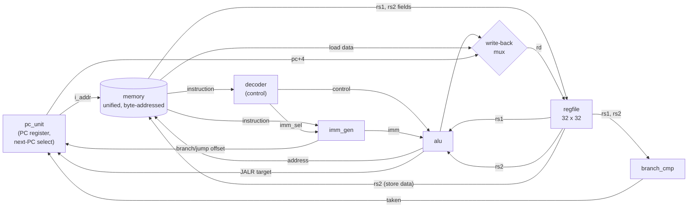

# rv32i-cpu

[](https://github.com/fahsinz/rv32i-cpu/actions/workflows/ci.yml)
[](LICENSE)


A single-cycle RISC-V **RV32I** processor in SystemVerilog, verified against a Python golden model with a cocotb scoreboard, and running on a DE10-Lite FPGA.

> **Status:** complete (Days 12–21). See [docs/ROADMAP.md](docs/ROADMAP.md).

| Feature | Details |
|---|---|
| **Instruction set** | RV32I base integer, all 37 instructions (`FENCE` retires as a NOP) |
| **Microarchitecture** | Single-cycle, unified byte-addressed memory, no trap handler — faults halt the machine with a latched cause |
| **Verification** | Python ISS golden model, per-instruction retirement scoreboard, constrained-random programs, functional coverage gate |
| **Proof it works** | **43 planted bugs, 43 caught** — a passing suite is not evidence on its own |
| **Hardware target** | Terasic DE10-Lite (Intel MAX 10 `10M50DAF484C7G`), single-steppable via push-button or free-running at 25 MHz |

---

## Table of Contents

- [The Datapath](#the-datapath)
- [Repository Layout](#repository-layout)
- [Quick Start](#quick-start)
  - [Prerequisites](#prerequisites)
  - [Installation](#installation)
  - [Running Tests](#running-tests)
  - [Waveform Inspection](#waveform-inspection)
- [Verification Architecture](#verification-architecture)
  - [1. Unit Testing](#1-unit-testing)
  - [2. Golden Model & Scoreboard](#2-golden-model--scoreboard)
  - [3. Mutation Testing (Bug Injection)](#3-mutation-testing-bug-injection)
  - [4. Functional Coverage Gate](#4-functional-coverage-gate)
- [On the FPGA](#on-the-fpga)
  - [Synthesis Results](#synthesis-results-max-10-10m50daf484c7g)
  - [Timing Closure & Fmax Engineering](#timing-closure--fmax-engineering)
  - [Hardware Demo & Controls](#hardware-demo--controls)
- [Design Notes](#design-notes)
- [Continuous Integration](#continuous-integration)
- [License](#license)

---

## The Datapath



Every datapath block is implemented in its own modular SystemVerilog file with an isolated cocotb testbench, and wired together in [rtl/core.sv](rtl/core.sv).

---

## Repository Layout

```
├── .github/workflows/
│   └── ci.yml               # Automated CI: tests, self-checks, and bug injection
├── docs/
│   ├── HARDWARE.md          # RTL -> FPGA guide: pinouts, timing analysis, bench testing
│   └── ROADMAP.md           # Implementation milestones and log (Days 12–21)
├── fpga/
│   ├── soc_top.sv           # DE10-Lite FPGA top: single-stepping, register monitor, 7-segs
│   ├── top.sv               # Combinational ALU switch demo top
│   ├── seg7.sv              # 7-segment hex display decoder
│   ├── de10_cpu.*           # Quartus project, pin assignments, SDC timing constraints
│   ├── de10_lite.*          # ALU demo Quartus project
│   ├── program.s            # Assembly program loaded onto the FPGA
│   ├── program.hex          # Assembled machine code for $readmemh
│   ├── build.ps1            # Command-line Quartus synthesis and assembly script
│   └── worst_path.tcl       # Timing analysis script for critical path reporting
├── rtl/                     # Synthesizable SystemVerilog
│   ├── rv32i_pkg.sv         # Opcodes, ALU operations, immediate formats, halt causes
│   ├── alu.sv               # 32-bit integer arithmetic, logic, shift, and comparisons
│   ├── regfile.sv           # 32 x 32-bit registers (x0 hardwired to 0, synchronous write)
│   ├── imm_gen.sv           # Immediate generation & sign-extension (I, S, B, U, J types)
│   ├── decoder.sv           # Instruction decoding and control signal generation
│   ├── branch_cmp.sv        # Branch condition evaluation (signed & unsigned)
│   ├── memory.sv            # Unified byte-addressed memory (sub-word loads/stores, alignment)
│   ├── pc_unit.sv           # Program counter register and next-PC multiplexing
│   ├── core.sv              # Single-cycle datapath integration + RVFI-style retirement trace
│   └── soc.sv               # Top-level SoC wrapper connecting core and memory
├── tools/
│   ├── inject_bugs.py       # Mutation testing harness: plants known bugs, requires test failure
│   └── build_program.py     # Assembles programs for the FPGA and predicts execution with ISS
├── verif/                   # Verification suite (cocotb + Python)
│   ├── asm.py               # Standalone RV32I assembler (no external toolchain required)
│   ├── iss.py               # Python RV32I Instruction Set Simulator (golden reference)
│   ├── isa.py               # Instruction definitions, bit patterns, and opcode encoders
│   ├── randgen.py           # Constrained-random assembly program generator
│   ├── coverage.py          # Functional coverage bins and pass/fail gate
│   ├── tb_core.py           # Full-core scoreboard checking retired instructions against ISS
│   ├── test_core.py         # Pytest entry point for full-core regression
│   ├── test_unit.py         # Pytest entry point for sub-block testbenches
│   └── unit/                # Individual block testbenches
│       ├── tb_alu.py
│       ├── tb_branch_cmp.py
│       ├── tb_decoder.py
│       ├── tb_imm_gen.py
│       ├── tb_memory.py
│       ├── tb_pc_unit.py
│       └── tb_regfile.py
├── LICENSE                  # MIT License
├── pyproject.toml           # Pytest configuration
├── README.md
└── requirements.txt         # Python dependencies (cocotb, pytest)
```

---

## Quick Start

### Prerequisites

- **Python 3.10+**
- **Icarus Verilog 12+** (`iverilog` and `vvp` available on your `PATH`)
  - *Windows:* `scoop install iverilog` or download from [bleyer.org](https://bleyer.org/icarus/)
  - *Linux (Ubuntu/Debian):* `sudo apt-get install iverilog`
  - *macOS:* `brew install icarus-verilog`
- *(Optional, for FPGA synthesis):* Intel Quartus Prime Lite Edition (tested with 25.1std).

### Installation

Clone the repository and install the Python dependencies:

```bash
git clone https://github.com/fahsinz/rv32i-cpu.git
cd rv32i-cpu
python -m pip install -r requirements.txt
```

### Running Tests

Run the full pytest suite (all block-level unit tests and the full-core regression):

```bash
python -m pytest -v
```

Run independent self-checks for the Python verification toolchain:

```bash
python -m verif.asm
python -m verif.iss
python -m verif.randgen
```

Run specific test targets:

```bash
# Run only ALU unit tests
python -m pytest -v -k alu

# Run only the full-core integration tests
python -m pytest -v -k core
```

### Waveform Inspection

To dump VCD waveforms during simulation, set the `WAVES` environment variable:

```powershell
# PowerShell (Windows)
$env:WAVES = "1"
python -m pytest -v -k core
```

```bash
# Bash (Linux / macOS)
WAVES=1 python -m pytest -v -k core
```

Waveforms are generated in `sim_build/<target>/dump.vcd` and can be viewed using [GTKWave](http://gtkwave.sourceforge.net/) or [Surfer](https://gitlab.com/surfer-project/surfer).

To reproduce a randomized test run with a specific seed:

```powershell
$env:COCOTB_RANDOM_SEED = "1234"
python -m pytest -v -k core
```

---

## Verification Architecture

Verification follows a 3-layer methodology designed to prove not just that the design passes tests, but that the tests reliably catch errors.

### 1. Unit Testing
Each datapath block is tested in isolation against an independent Python model across both directed edge cases and randomized stimulus:
- **ALU:** Full corner grid (zero, min/max signed and unsigned integers, bit rotations, shift overflow).
- **Decoder:** 5,000 random words (verifying illegal instruction traps and control signal muting).
- **Immediate Generator:** Walking-one sweeps across all 32 instruction bits for each encoding format (`I`, `S`, `B`, `U`, `J`).
- **Memory:** Misalignment detection, byte enable lane isolation, and load extension checks.
- **Register File:** Port independence, write-enable masking, and strict `x0` immutability.

### 2. Golden Model & Scoreboard
[verif/tb_core.py](verif/tb_core.py) executes assembled programs on the full SoC and scores every instruction against the Python Instruction Set Simulator ([verif/iss.py](verif/iss.py)).
- **Retirement Interface:** The core exposes a `commit_*` retirement trace (inspired by RVFI), publishing instruction word, PC, next PC, destination register, writeback data, memory address, and memory write data each retirement.
- **Cycle-by-Cycle Scoreboard:** Every retired instruction is checked against the ISS.
- **Architectural State Assertion:** On program halt, all 32 registers, halt cause, and memory contents are verified against the ISS.
- **Test Programs:** Includes Fibonacci sequence, a 688-instruction bubble sort, deliberate exception triggers, and constrained-random instruction streams.

### 3. Mutation Testing (Bug Injection)
A passing test suite does not prove bug detection capability. [tools/inject_bugs.py](tools/inject_bugs.py) automatically injects 43 distinct, realistic RTL bugs into clean scratch copies and requires the test suite to fail:

```bash
python tools/inject_bugs.py
```

```
KILLED   alu         1/1 tests failed  <- SRA does a logical shift
KILLED   alu         1/1 tests failed  <- SLT compares unsigned
KILLED   regfile     1/1 tests failed  <- rs2 port reads the rs1 address
KILLED   decoder     3/4 tests failed  <- JALR writes the ALU result, not the link address
KILLED   soc         4/5 tests failed  <- core: ALU operand B mux inverted
...
43/43 injected bugs caught
```

*All 43 planted mutants are detected and killed by the test suite.*

### 4. Functional Coverage Gate
[verif/coverage.py](verif/coverage.py) samples retired instructions from the trace. All 32 architectural coverage bins must be hit during regression, including:
- Every instruction type and ALU operation.
- Branches taken and not taken (forward and backward).
- Byte, halfword, and word memory accesses across all byte lanes.
- Shift amounts at limits (0 and 31).
- Discarded writes targeting `x0`.

---

## On the FPGA

The design targets the **Terasic DE10-Lite** development board featuring an Intel MAX 10 FPGA (`10M50DAF484C7G`).

### Synthesis Results (MAX 10 `10M50DAF484C7G`)

| Metric | Value | Utilization |
|---|---|---|
| **Logic Elements** | 5,667 | 11% (5,667 / 49,760) |
| **Registers** | 3,253 | 7% (3,253 / 49,760) |
| **Memory Bits** | 2,048 | <1% (2,048 / 1,677,312) |
| **User Pins** | 71 | 20% (71 / 360) |
| **Instruction Rate** | 25 MHz | 1 instruction per two 50 MHz clocks |
| **Setup Slack** | **+6.015 ns** | Total Negative Slack (TNS) = 0.000 |

### Timing Closure & Fmax Engineering

A single-cycle processor executes the entire datapath combinationally in one clock period:
$$\text{PC} \longrightarrow \text{I-Mem} \longrightarrow \text{Decode} \longrightarrow \text{Reg Read} \longrightarrow \text{ALU} \longrightarrow \text{D-Mem} \longrightarrow \text{Writeback}$$

Clocked on every 50 MHz cycle, this path achieved an $F_{\text{max}}$ of 35.16 MHz (setup slack of **−8.44 ns**).

To achieve robust timing closure without requiring a derived PLL clock domain, the CPU advances on an alternating clock enable (`step_en`):
- Operates on a single synchronous 50 MHz clock domain.
- `step_en` pulses every two clocks, resulting in a 25 MHz instruction execution rate.
- Multi-cycle path constraints (`set_multicycle_path 2`) were applied in `fpga/de10_cpu.sdc`.
- Analyzing the critical path using Quartus Timing Analyzer revealed the register-watch multiplexer in `soc_top.sv` was the limiting path; scoping the multicycle constraint correctly brought final slack to **+6.015 ns**.

### Hardware Demo & Controls

The hardware build includes single-stepping and live register monitoring:

1. **Assemble the Demo Program:**
   ```bash
   python tools/build_program.py --run
   ```
2. **Synthesize and Program:**
   ```powershell
   cd fpga
   .\build.ps1
   ```
   *(See [docs/HARDWARE.md](docs/HARDWARE.md) for full pinouts, Quartus GUI steps, and programming instructions).*

3. **Board Interface:**
   - **`SW[9]`**: Run mode toggle (HIGH = free-running at 25 MHz, LOW = single-step mode).
   - **`KEY[0]`**: Active-low asynchronous reset.
   - **`KEY[1]`**: Single-step trigger (advances exactly one instruction per press).
   - **`SW[4:0]`**: Register select index (shows register $x0$ through $x31$ on 7-segment displays).
   - **`SW[8]`**: Display select (LOW = selected register value, HIGH = current PC).
   - **`LEDR[4:0]`**: CPU halt cause indicators (`ECALL`, `EBREAK`, `ILLEGAL`, `MISALIGNED_LOAD/STORE`, `MISALIGNED_PC`).

---

## Design Notes

- **ALU Op Encoding:** The ALU operation codes directly mirror `{funct7[5], funct3}` for R-type instructions, eliminating ALU decoding lookup logic.
- **Register File:** 32 registers with two combinational read ports and one synchronous write port. Writes to `x0` are suppressed, and reads from `x0` are hardwired to zero.
- **Immediate Generator:** The sign bit is always mapped from `inst[31]` across all formats, allowing sign extension logic to proceed in parallel with opcode decoding.
- **Zero-Bypass Control:** Unrecognized opcodes immediately assert `illegal` and force all datapath write enables low, preventing corrupted state writes.
- **Unified Byte-Addressed Memory:** Word-organized RAM supporting byte, halfword, and word operations with byte-enables. Misaligned accesses are rejected and raise halt flags.
- **Bench-Friendly Halts:** Rather than branching to an unconfigured trap vector, architectural faults freeze the PC on the faulting instruction and latch the halt cause for display on board LEDs.

---

## Continuous Integration

Every push and pull request triggers automated validation via [GitHub Actions](.github/workflows/ci.yml):
- **Simulation Regression:** Runs block-level and core tests with Icarus Verilog and cocotb.
- **Self-Checks:** Executes assembler, ISS golden model, and random generator consistency checks.
- **Mutation Verification:** Executes the full 43-bug injection harness, failing the build if any bug survives.

---

## License

This project is licensed under the [MIT License](LICENSE).
